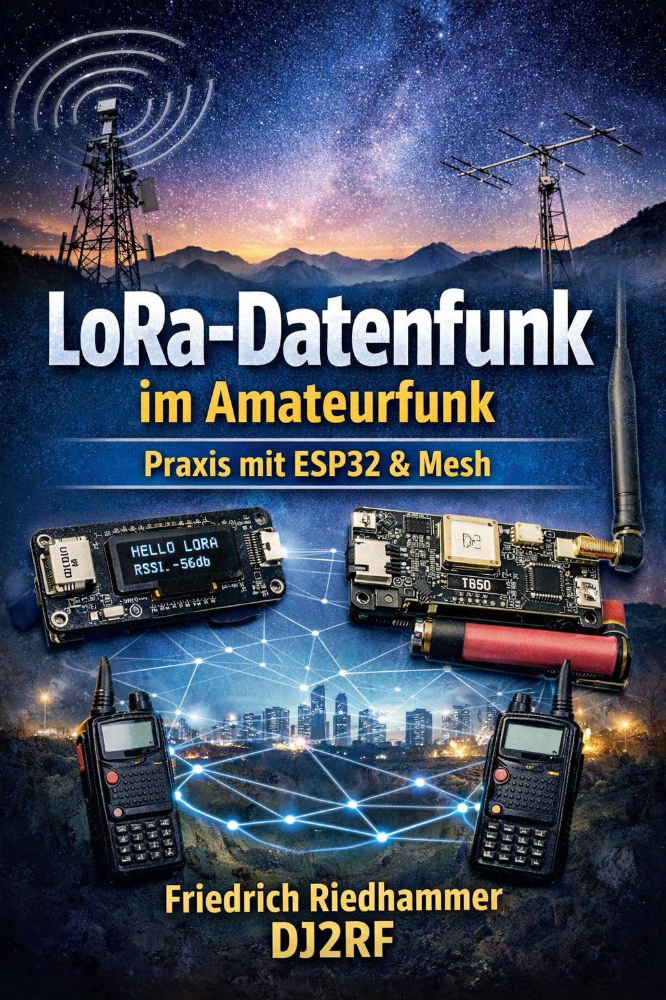
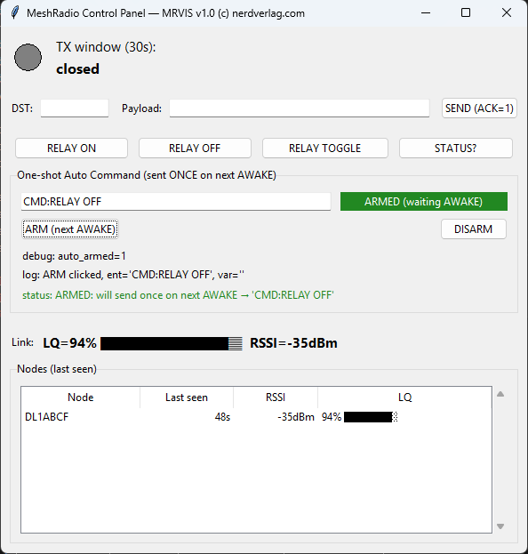
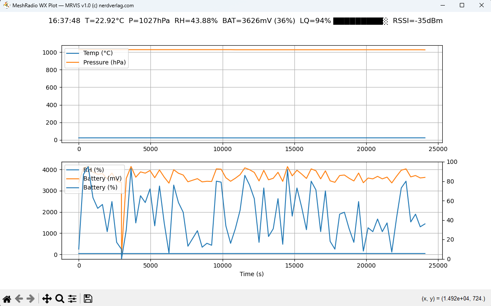

# English at bottom

# Begleit Software für das MeshRadio Buch:

## https://nerdverlag.com

## fritz@nerdverlag.com

# MeshRadio – LoRa Mesh Node (ESP-IDF)

MeshRadio ist ein zuverlässiger LoRa-Mesh-Knoten für ESP32-basierte Hardware, entwickelt mit ESP-IDF.

Das Projekt implementiert ein robustes, mehrstufiges LoRa-Mesh-Netzwerk, das auf kostengünstiger Hardware betrieben werden kann.
Es eignet sich für Anwendungen wie:

IoT-Infrastruktur
Sensornetzwerke
verteilte Telemetrie
autonome Kommunikationssysteme
experimentelle oder produktionsnahe Mesh-Netzwerke
Der Schwerpunkt liegt auf stabiler Kommunikation, klarer Architektur und guter Erweiterbarkeit.
Hauptfunktionen
MeshRadio bietet unter anderem:
mehrstufiges LoRa-Mesh-Routing
automatische Nachbarerkennung
ACK-Mechanismus mit Wiederholversuchen
ETX-basierte Linkqualitätsbewertung
optionale AES-CCM-Verschlüsselung
integrierte WiFi-Konfiguration
HTTP-Status-API
serielle CLI

## Batterieüberwachung

optionale Sensorintegration (z. B. BME280)
Das System kann als Mesh-Router, Edge-Node oder Sensor-Node betrieben werden.
Unterstützte Hardware
Der Code unterstützt derzeit zwei Hardwareplattformen.

## Heltec LoRa 32 V3.x

MCU: ESP32-S3

## Funkchip: SX1262

LoRa-Treiber: Command-basierter SX126x-Treiber
integrierte Batteriemessung
VEXT-Versorgungsschiene
Typisches Pin-Mapping:
Signal	GPIO
NSS	8
SCK	9
MOSI	10
MISO	11
RESET	12
BUSY	13
DIO1	14
LILYGO / TTGO LoRa32

MCU: ESP32

Funkchip: SX1276 / SX1278
LoRa-Treiber: Registerbasierter SX1276-Treiber
Typisches Pin-Mapping:
Signal	GPIO
NSS	18
SCK	5
MOSI	27
MISO	19
RESET	23
DIO0	26

## Projektstruktur

MeshRadio verwendet ein kompaktes Frame-Format für effiziente LoRa-Übertragung.
Jedes Paket enthält unter anderem:
Quell-Callsign / Node-ID
endgültiges Ziel
nächsten Hop
letzten Hop
TTL (Hop-Limit)
Sequenznummer
Message-ID
Nutzdaten
Maximale Nutzdaten:
120 Bytes
Bei aktivierter Verschlüsselung:
112 Bytes Payload + 8 Byte Authentifizierungstag

## Frame-Typen:

Typ	Beschreibung
DATA	Nutzdatenpaket
BEACON	Nachbarerkennung
ACK	Empfangsbestätigung
ROUTEADV	Routing-Information

## Routing

Das Routing basiert auf mehreren Mechanismen:
Beacon-Pakete zur Nachbarerkennung
ETX-Metrik zur Bewertung der Linkqualität
periodische Route Advertisements
Hold-Down-Timer zur Stabilisierung der Routen
Jeder Node verwaltet lokal:
Nachbartabelle
Routingtabelle
Replay-Cache
Sicherheit

## Optional kann AES-CCM-Verschlüsselung aktiviert werden.

Eigenschaften:
128-Bit AES
12-Byte Nonce
authentifizierte Verschlüsselung
Replay-Schutz über Sequenznummern
Beispielkonfiguration:

#define DEFAULT_CRYPTO_ENABLE 1
#define MR_NET_KEY_HEX "00112233445566778899AABBCCDDEEFF"

## Node-Rollen

Ein Node kann in verschiedenen Rollen betrieben werden.

Rolle	Beschreibung
RELAY	vollständiger Mesh-Router
EDGE	Endgerät
SENSOR	energieoptimierter Sensorknoten

Standard:

#define DEFAULT_NODE_MODE 0
Energiesparmodus

Sensor-Nodes können mit Energiesparmechanismen betrieben werden.

Beispiel:

#define MR_POWERSAVE_ENABLE 1           NUR IM SONSOR MODE!
#define SENSOR_WAKE_PERIOD_MS 300000

Der Sensor Node wacht periodisch auf, überträgt Daten und wechselt anschließend wieder in den Sleep-Modus.

## WiFi-Konfiguration

Beim Start kann der Node einen WiFi-Access-Point bereitstellen.

Standardkonfiguration:

SSID: MeshRadio-Setup
Passwort: offen

Zugriff über:
http://192.168.4.1
Die Weboberfläche ermöglicht:
Statusanzeige
Konfiguration
Rollenwechsel
Debug-Informationen

## HTTP-API

Der Node stellt eine einfache HTTP-API zur Verfügung.
Beispiel:
/api/status
Die Antwort enthält u. a.:
Node-Modus
Batteriestatus
Routing-Informationen
WiFi-Status
Sicherheitsstatus

## Serielle CLI

Eine serielle Kommandozeile steht über UART zur Verfügung.

Beispiele:

status
role relay
role edge
role sensor
send TEST

Die CLI eignet sich besonders für Entwicklung, Tests und Diagnose.

## Sensoren

Optional kann ein BME280-Sensor integriert werden.

Konfiguration:

#define MR_BME280_ENABLE 1
#define BME280_I2C_ADDR 0x76

Der Sensor liefert:

Temperatur
Luftdruck
Luftfeuchtigkeit
Batteriemessung
Die Batteriespannung kann über ADC gemessen werden.

Konfiguration:

#define MR_BATT_ENABLE 1

Die Messwerte werden über:

HTTP-API
CLI
interne Telemetrie
bereitgestellt.
Kompilieren

Voraussetzungen:

ESP-IDF v5.x

unterstütztes ESP32-Board

Build:
idf.py build
Flashen:
idf.py flash monitor

Beispiel-Log
MeshRadio starting...
LoRa chip detected
Beacon interval: 30s
WiFi AP started
HTTP server running

## Lizenz

Die Software wird ohne Gewährleistung bereitgestellt.
Nutzung, Anpassung und Weiterentwicklung sind im Rahmen der jeweiligen gesetzlichen und regulatorischen Vorgaben zulässig.

Autor

Friedrich Riedhammer – DJ2RF

## MeshRadio ist Teil einer Entwicklungsplattform für:

LoRa-Mesh-Netzwerke
IoT-Kommunikation

verteilte Sensornetze

drahtlose Telemetrie

# English

# Companion Software for the MeshRadio Book:
## https://nerdverlag.com
## fritz@nerdverlag.com

  

# MeshRadio – LoRa Mesh Node (ESP-IDF)

MeshRadio is a reliable LoRa mesh node for ESP32-based hardware, developed using ESP-IDF.

The project implements a robust, multi-hop LoRa mesh network that can run on low-cost hardware.
It is suitable for applications such as:

IoT infrastructure
sensor networks
distributed telemetry
autonomous communication systems
experimental or production-like mesh networks

The focus is on stable communication, clear architecture and good extensibility.

Main Features

MeshRadio offers among others:

multi-hop LoRa mesh routing
automatic neighbor discovery
ACK mechanism with retries
ETX-based link quality evaluation
optional AES-CCM encryption
integrated WiFi configuration
HTTP status API
serial CLI

## Battery monitoring

## optional sensor integration (e.g. BME280)

The system can operate as a mesh router, edge node or sensor node.

## Supported Hardware

The code currently supports two hardware platforms.

Heltec LoRa 32 V3.x

MCU: ESP32-S3

Radio chip: SX1262

LoRa driver: command-based SX126x driver
integrated battery measurement
VEXT power rail

Typical pin mapping:

Signal GPIO
NSS 8
SCK 9
MOSI 10
MISO 11
RESET 12
BUSY 13
DIO1 14

LILYGO / TTGO LoRa32

MCU: ESP32

Radio chip: SX1276 / SX1278
LoRa driver: register-based SX1276 driver

Typical pin mapping:

Signal GPIO
NSS 18
SCK 5
MOSI 27
MISO 19
RESET 23
DIO0 26

## Project Structure

MeshRadio uses a compact frame format for efficient LoRa transmission.

Each packet contains among others:

source callsign / node ID
final destination
next hop
last hop
TTL (hop limit)
sequence number
message ID
payload

## Maximum payload:

120 Bytes

With encryption enabled:

112 Bytes payload + 8 byte authentication tag

## Frame Types:

Type Description
DATA payload packet
BEACON neighbor discovery
ACK acknowledgement
ROUTEADV routing information

## Routing

Routing is based on several mechanisms:

beacon packets for neighbor discovery
ETX metric for link quality evaluation
periodic route advertisements
hold-down timers to stabilize routes

Each node maintains locally:

neighbor table
routing table
replay cache

## Security

AES-CCM encryption can optionally be enabled.

Features:

128-bit AES
12-byte nonce
authenticated encryption
replay protection via sequence numbers

## Example configuration:

#define DEFAULT_CRYPTO_ENABLE 1
#define MR_NET_KEY_HEX "00112233445566778899AABBCCDDEEFF"

## Node Roles

A node can operate in different roles.

Role Description
RELAY full mesh router
EDGE end device
SENSOR energy optimized sensor node

   

Default:

#define DEFAULT_NODE_MODE 0

Power Save Mode

Sensor nodes can operate with power saving mechanisms.

Example:

#define MR_POWERSAVE_ENABLE 1 ONLY IN SENSOR MODE!
#define SENSOR_WAKE_PERIOD_MS 300000

The sensor node wakes up periodically, transmits data and then switches back to sleep mode.

## WiFi Configuration

At startup the node can provide a WiFi access point.

Default configuration:

SSID: MeshRadio-Setup
Password: open

Access via:

http://192.168.4.1

The web interface allows:

status display
configuration
role switching
debug information

## HTTP API

The node provides a simple HTTP API.

Example:

/api/status

The response includes among others:

node mode
battery status
routing information
WiFi status
security status

## Serial CLI

A serial command line interface is available via UART.

Examples:

status
role relay
role edge
role sensor
send TEST

The CLI is particularly useful for development, testing and diagnostics.

## Sensors

A BME280 sensor can optionally be integrated.

Configuration:

#define MR_BME280_ENABLE 1
#define BME280_I2C_ADDR 0x76

The sensor provides:

temperature
air pressure
humidity

## Battery Measurement

The battery voltage can be measured via ADC.

Configuration:

#define MR_BATT_ENABLE 1

The values are provided via:

HTTP API
CLI
internal telemetry

Compilation

Requirements:

ESP-IDF v5.x

supported ESP32 board

Build:

idf.py build

Flash:

idf.py flash monitor

Example Log

MeshRadio starting...
LoRa chip detected
Beacon interval: 30s
WiFi AP started
HTTP server running

License

The software is provided without warranty.
Usage, modification and further development are permitted within the framework of the respective legal and regulatory requirements.

Author

Friedrich Riedhammer – DJ2RF

MeshRadio is part of a development platform for:

LoRa mesh networks
IoT communication

distributed sensor networks

wireless telemetry
